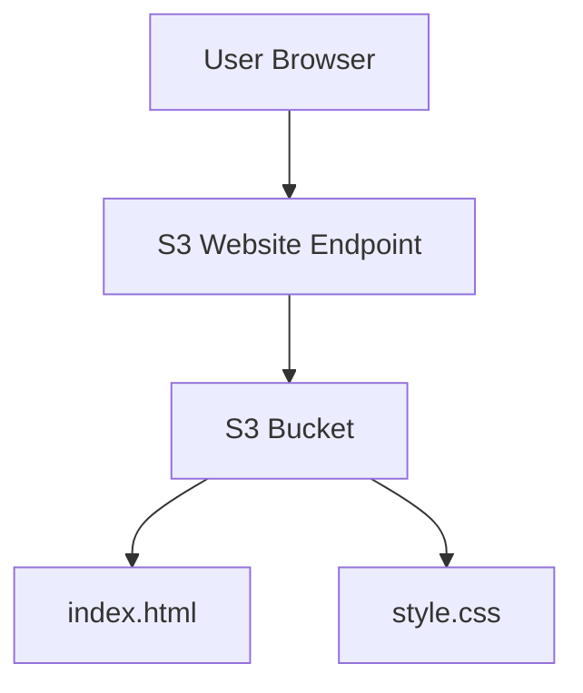

# 🗓️ Date: 06/06/26

---

# 🚀 AWS S3 Static Website Hosting Project

---

## 📌 Project Overview

This project demonstrates how to deploy a static website using Amazon S3 (Simple Storage Service). It includes the full process of creating an S3 bucket, configuring permissions, uploading website files, enabling static hosting, and making the website publicly accessible.

The goal is to understand how AWS S3 can be used as a low-cost, scalable solution for hosting static websites.

---

## 📂 Project Files

- **index.html** → Main homepage of the website  
- **style.css** → Styling for the website layout and design  

---

## ⚙️ Step-by-Step Implementation

---

### 1. Create S3 Bucket🪣

Created a bucket named:

```
rodhel-cloud-static-site-2026-556834267653-us-east-1-an
```

**Purpose:** Stores all website files in a centralized location.  
**Result:** A storage container is ready for hosting web assets.

---

### 2. Upload Website Files

Uploaded:

- index.html  
- style.css  

**Purpose:** Provides content and styling for the website.  
**Result:** Website structure and design are now stored in S3.

---

### 3. Disable Block Public Access

Turned off **“Block all public access”** settings.

**Purpose:** Allows external users to access website files.  
⚠️ AWS blocks public access by default for security reasons.

**Result:** Bucket can now be made publicly accessible with policies.

---

### 4. Configure Bucket Policy

Added a policy granting:

```
s3:GetObject
```

**Purpose:** Defines read access for objects in the bucket.  
**Result:** Users can now retrieve website files through the browser.

---

### 5. Enable Static Website Hosting

Enabled static website hosting in S3 settings.  
Set:

```
Index document: index.html
```

**Purpose:** Configures S3 to behave like a web server.  
**Result:** AWS generates a public website endpoint.

---

### 6. Access Website Endpoint

Opened the S3 website URL in a browser.

**Purpose:** To verify deployment and accessibility.  
**Result:** Website loads successfully if configuration is correct.

---

### 7. Deployment Success 🎉

Website is fully live and publicly accessible.

**Final Result:** Static website is successfully hosted on AWS S3.

---

## 🌐 Key AWS Concepts Learned

- Amazon S3 Buckets  
- Static Website Hosting  
- Bucket Policies (IAM basics)  
- Public Access Configuration  
- Object Storage & Web Hosting  

---

## 🏗️ Architecture Diagram



---

## 📊 Summary

This diagram shows how a user request flows through AWS S3:

- User opens website in browser  
- Request goes to S3 Website Endpoint  
- S3 serves `index.html` and `style.css`  
- Browser renders the final webpage  

---
